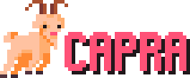

## About

Capra is an experimental, event-based graphics/game engine focused on ease of use. Inspiration drawn from libraries such as PyGame for Python, and LOVE2D for Lua. Currently, there is more support being given to low-res/pixel art style graphics and primitives, but ideally in the future any kind of graphics will be supported. 

## Features

TODO

## Credits

Goat in the logo and icon from this [tutorial](https://lifebe.com.au/artistic/pixel-art-tutorial-farmyard-goat/).

Submodules used in this project:
- [{fmt}](https://github.com/fmtlib/fmt)
- [glad](https://github.com/Dav1dde/glad/tree/glad2)
- [GLFW](https://github.com/glfw/glfw)
- [GLM](https://github.com/g-truc/glm)
- [Dear ImGui](https://github.com/ocornut/imgui/tree/docking)
- [ImPlot](https://github.com/epezent/implot)
- [Libnyquist](https://github.com/ddiakopoulos/libnyquist)
- [OpenAL soft](https://github.com/kcat/openal-soft)
- [pcg-cpp](https://github.com/imneme/pcg-cpp)
- [spdlog](https://github.com/gabime/spdlog)
- [stduuid](https://github.com/mariusbancila/stduuid)